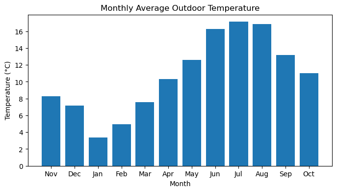
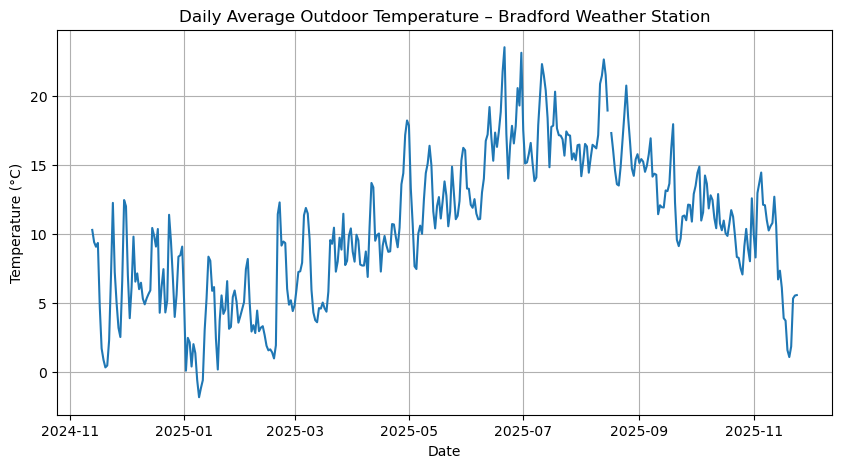
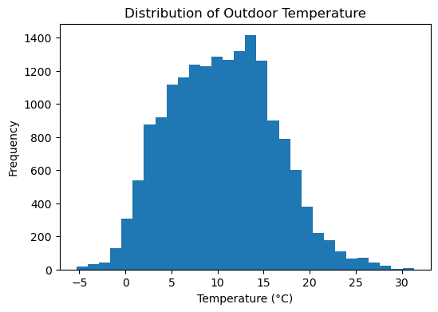
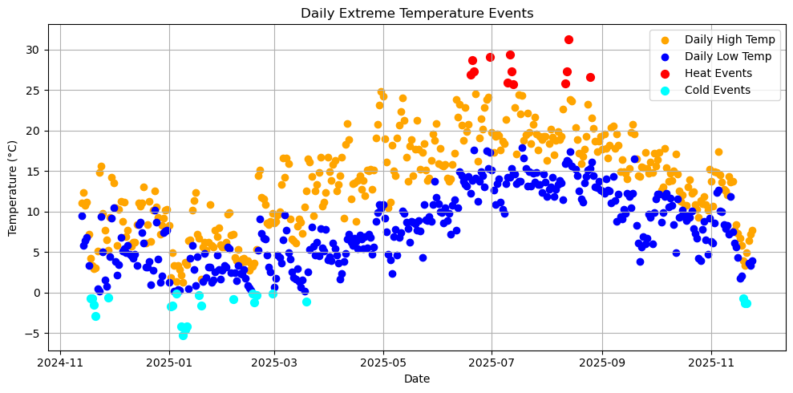
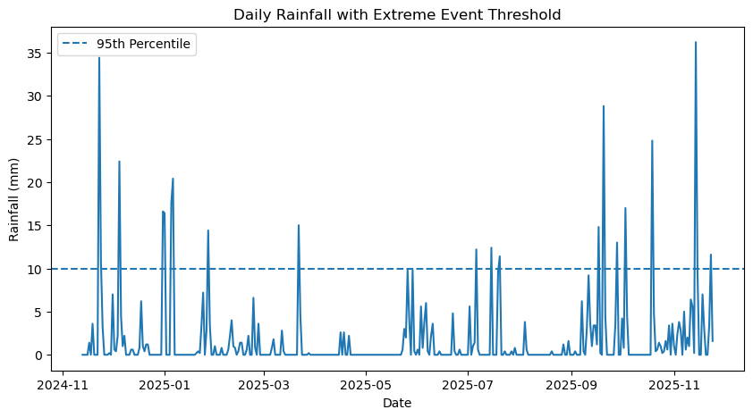
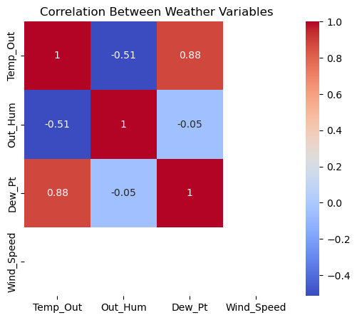
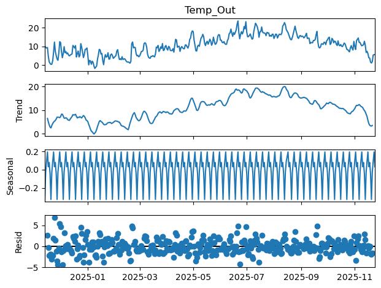

# 🌦️ Bradford Weather Visual Analytics


## 📌 Project Overview

**Bradford Weather Visual Analytics** is a Python-based exploratory data analysis project examining approximately one year of meteorological observations from the **University of Bradford Weather Station**.

The project transforms raw weather data into clear visual insights by analysing temperature patterns, rainfall extremes, seasonal behaviour, extreme weather events, and relationships between meteorological variables.

The analysis demonstrates practical skills in **data preparation, exploratory data analysis, statistical visualisation, time-series analysis, and interpretation of real-world environmental data**.

---

## 🎯 Project Objectives

The analysis explores the following questions:

- How does outdoor temperature change throughout the year?
- What seasonal patterns are visible in the temperature data?
- When do unusually high and low temperature events occur?
- How frequently do extreme rainfall events occur?
- What is the overall distribution of recorded outdoor temperatures?
- What relationships exist between key meteorological variables?
- Can the temperature series be separated into trend, seasonal, and irregular components?

---

## 🛠️ Tools & Technologies

| Technology | Purpose |
|---|---|
| **Python** | Core programming language |
| **Jupyter Notebook** | Interactive analysis environment |
| **Pandas** | Data cleaning, transformation, and aggregation |
| **NumPy** | Numerical operations |
| **Matplotlib** | Data visualisation |
| **Seaborn** | Statistical visualisation |
| **Statsmodels** | Time-series and seasonality analysis |

---

# 📊 Exploratory Data Analysis

## 🌡️ Monthly Average Outdoor Temperature

Monthly average temperature reveals a clear seasonal cycle.

The coldest average conditions occur during the winter period, with January recording an average temperature of approximately **3°C**. Temperatures rise through spring and reach their highest monthly average during July at approximately **17°C**, before declining again through autumn.



---

## 📈 Daily Average Outdoor Temperature

Daily average temperature provides a more detailed view of weather variation throughout the observation period.

Although temperatures fluctuate considerably from day to day, the broader annual pattern remains visible. Cooler conditions dominate the winter months, temperatures increase through spring, peak during summer, and fall again toward the end of the year.



---

## 📊 Distribution of Outdoor Temperature

The temperature distribution illustrates how frequently different outdoor temperatures occurred in the dataset.

Most observations are concentrated within moderate temperature ranges, while temperatures at the extreme cold and hot ends of the distribution occur less frequently.



---

# 🔥❄️ Extreme Temperature Events

Daily high and low temperatures were examined to identify unusually hot and cold weather events.

The analysis shows that heat events are concentrated mainly during the summer period, while cold events occur primarily during winter. The highest recorded temperatures rise above **30°C**, highlighting several periods of unusually warm conditions.



---

# 🌧️ Extreme Rainfall Analysis

Daily rainfall was analysed to identify unusually heavy precipitation events.

A **95th-percentile threshold** was used to distinguish extreme rainfall events from more typical daily rainfall observations. Most days experienced relatively low rainfall, while a smaller number of events exceeded approximately **10 mm per day**.

The most substantial rainfall event in the analysed period exceeded **35 mm**.



---

# 🔗 Multivariate Analysis

Relationships between selected meteorological variables were explored using correlation analysis.

The analysis identifies a strong positive relationship between **outdoor temperature and dew point**, with a correlation of approximately **0.88**.

Outdoor temperature and relative humidity show a moderate negative relationship of approximately **-0.51**, indicating that warmer conditions within the dataset are generally associated with lower relative humidity.



---

# 📉 Seasonality Analysis

Seasonality analysis was used to examine the underlying structure of the temperature time series.

The decomposition separates the observed temperature data into:

- **Observed values**
- **Trend**
- **Seasonal variation**
- **Residual variation**

The trend component captures the broader movement from cooler winter conditions to warmer summer temperatures and back toward cooler conditions.

The seasonal component represents recurring patterns in the data, while the residual component captures short-term variation that is not explained by the identified trend or seasonality.



---

# 💡 Key Findings

The analysis identified several important patterns in the Bradford weather data.

### Seasonal Temperature Behaviour

Outdoor temperature follows a clear annual cycle, with the lowest average temperatures occurring during winter and the highest temperatures occurring during summer.

### Temperature Extremes

Extreme heat events occur mainly during the summer months, while unusually cold observations are concentrated in winter.

### Rainfall Extremes

Most days experience relatively small rainfall totals, but several isolated periods show substantially heavier precipitation.

### Meteorological Relationships

Temperature and dew point demonstrate a strong positive relationship, while temperature and relative humidity show a moderate negative relationship.

### Time-Series Structure

The temperature data contains identifiable trend and seasonal components alongside short-term irregular variation.

---

# 🔄 Analysis Workflow

```text
Raw Weather Data
        │
        ▼
Data Import
        │
        ▼
Data Cleaning & Preparation
        │
        ▼
Exploratory Data Analysis
        │
        ├── Daily Temperature Analysis
        ├── Monthly Temperature Analysis
        ├── Temperature Distribution
        ├── Extreme Temperature Events
        ├── Extreme Rainfall Events
        ├── Multivariate Analysis
        └── Seasonality Analysis
        │
        ▼
Data Visualisation
        │
        ▼
Interpretation of Weather Patterns
```

---

# 📁 Project Visualisations

The project contains the following visual outputs:

```text
images/
│
├── daily_average_temperature.png
├── extreme_rainfall_events.png
├── extreme_temperature_events.png
├── monthly_average_temperature.png
├── Multivariate_analysis.png
├── seasonality_analysis.png
└── temperature_distribution_.png
```

---

# 📓 Jupyter Notebook

## 📓 Jupyter Notebook

The complete analysis, including data preparation, exploratory analysis, statistical analysis, and visualisations, is available in the project notebook:

👉 [View the Bradford Weather Analysis Notebook](notebooks/bradford_weather_analysis.ipynb)

---

# ⚠️ Limitations

This analysis covers approximately one year of observations from a single weather station.

The results therefore describe weather behaviour during the analysed period and should not be interpreted as evidence of long-term climate trends.

A dataset covering multiple years would allow stronger assessment of year-to-year variation, unusual weather events, and longer-term changes in meteorological conditions.

---

# 🚀 Future Improvements

Future development of this project could include:

- Multi-year weather trend analysis
- Interactive weather dashboards
- Temperature forecasting
- Rainfall prediction
- Automated anomaly detection
- Additional statistical modelling
- Power BI or Tableau dashboard development
- Comparison with external meteorological datasets

---


---

⭐ If you found this project useful, feel free to explore the repository and analysis.
